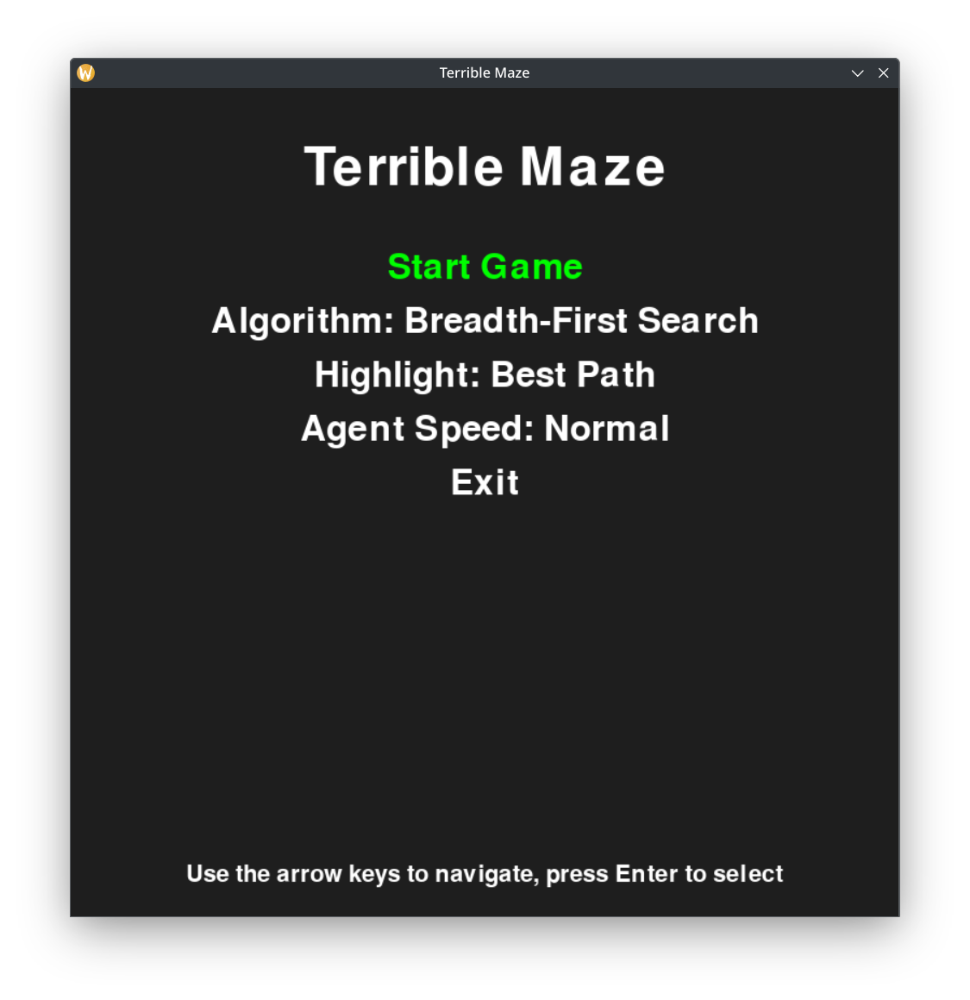
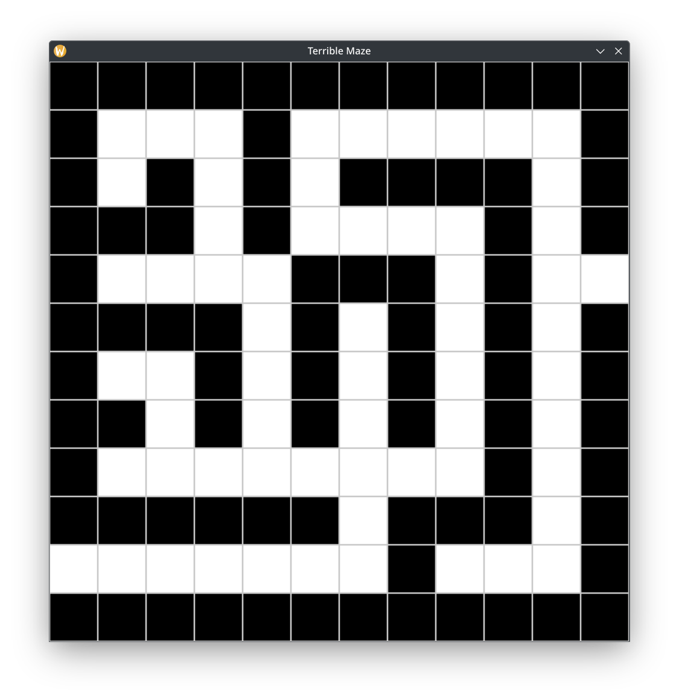
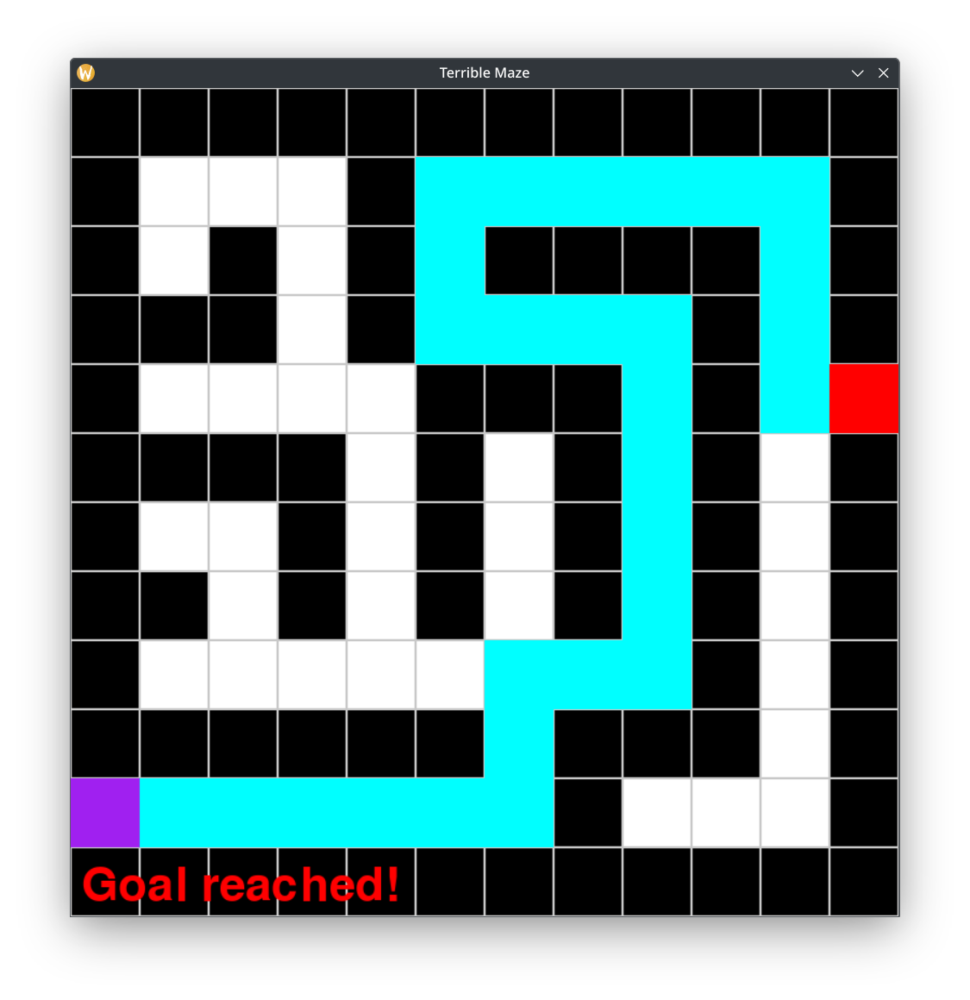

# Projeto de Inteligência Artifical

## SIN 323 - Inteligência Artificial
## Universidade Federal de Viçosa - Campus Rio Paranaíba

### Descrição

Este projeto foi desenvolvido para a disciplina SIN 323 - Inteligência Artificial e tem como objetivo a implementação e a visualização de alguns dos algoritmos de busca mais comuns.

### Requisitos

* Python 3.x
* Bibliotecas: `pygame`

### Instalação

1. Instale a biblioteca `pygame`:
   ```bash
   pip install pygame
   ```
2. Para executar o programa, use o comando:
   ```bash
   python main.py
   ```

### Imagens





### Autores

* Luís Fernando Almeida - [luisfernalme@gmail.com](mailto:luisfernalme@gmail.com)
